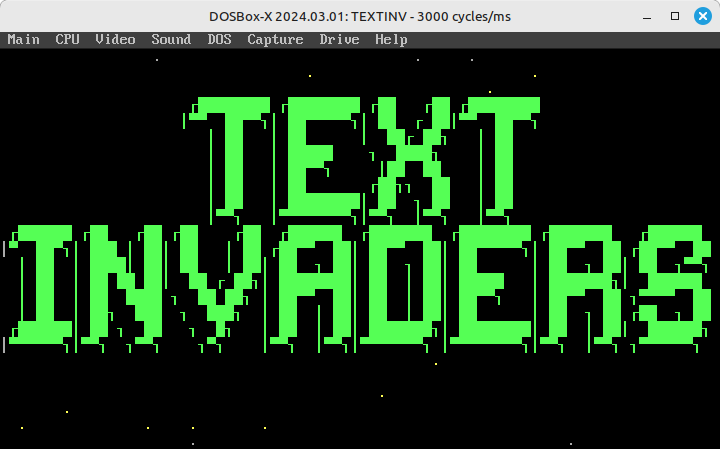
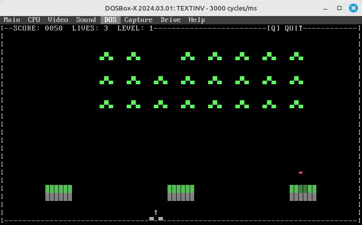
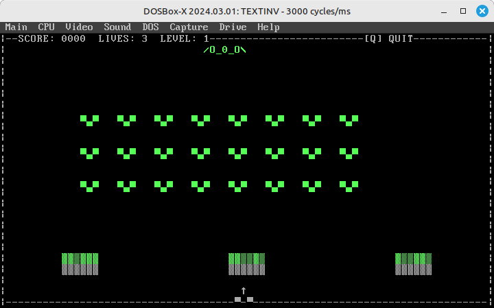

SPACE INVADERS is a retro arcade shooter written in C for MS-DOS. It recreates the classic "Space Invaders" experience using standard ASCII characters and direct video memory manipulation for fast rendering in text mode (80x25).

Features

- Classic Gameplay: Defend Earth from waves of invaders.
- Progressive Difficulty: Enemies get faster and more aggressive with each level.
- Bonus Enemies: Watch out for the animated UFOs dropping bombs!
- Audio: PC Speaker sound effects for shooting, explosions, and UFO movement.
- Visuals:
- Smooth text-mode rendering.
- Animated enemies.
- Destructible bunkers.
- Starfield background.
- Soft Reset System: If you get hit, the level resets positions but keeps the damage state.

Controls

- Left / Right Arrows: Move Ship
- Space: Fire

Requirements & Compilation

This project is designed for 16-bit MS-DOS Real Mode.

- Compiler: Borland Turbo C++ 3.0 (or similar DOS C compilers).
- Emulator: DOSBox or DOSBox-X (recommended for running on modern systems).

How to Compile

1. Open `TEXTINV.C` in Turbo C++.
2. Ensure the target is set to DOS Standard.
3. Compile and Link.
4. Run `TEXTINV.EXE`.

Note: This code uses `<conio.h>`, `<dos.h>`, and direct video memory access (`0xB8000000`), so it will not compile directly on modern GCC/Clang without a compatibility layer.

License

This project is licensed under the MIT License - see the [LICENSE](LICENSE) file for details.
